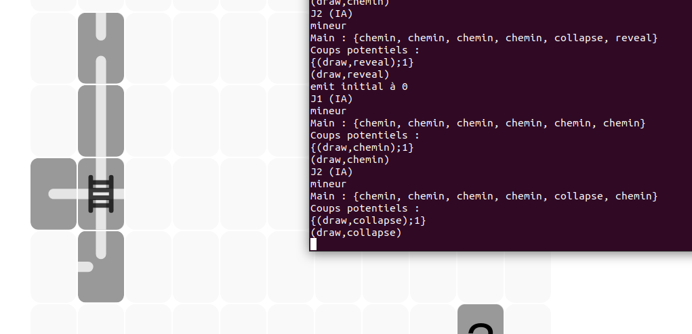

# Bug IA

1. (*RESOLU*) Le reveal n'est pas considéré.

 

**Solution** Test sur cardType au lieu de cardId (même problème que #bug05).

2. (*RESOLU*) Les culs de sacs ne sont pas détectés.

**Solution** Appeler IA.deviner lors de l'update.

3. (*RESOLU*) Ne répart pas son objet cassé.

**Solution** Update des données de l'IA avant chaque coup.

4. (*RESOLU*) Se casse son propre outil.

**Solution** Ajout de la condition cible != ia.playerId

5. (*RESOLU*) Reveal est considéré comme un chemin.

**Solution** Test sur cardType au lieu de cardId.

6. (*RESOLU*) L'affichage des items se fait avec un tour de décalage.

**Solution** L'event "*updatePlayerState*" n'est pas envoyé aux joueurs humains.

7. (*RESOLU*) Priorité non respectée.

**Solution** Erreur = au lieu de == dans une condition.

8. (*RESOLU*) Après le collapse sur un cul-de-sac, la liste des culs-de-sac ne se met pas à jour.

**Solution** Le collapse était mal détecté + la fonction n'était pas appelée lorsque l'IA jouait.